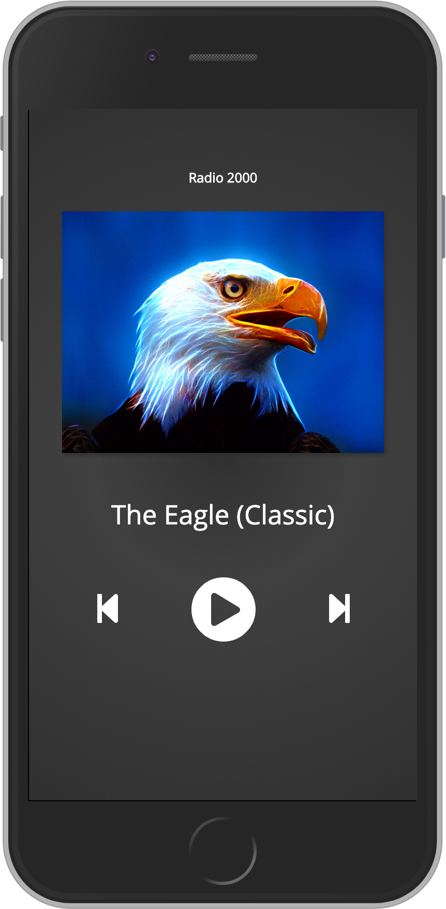

# Frontend Tech Test

## The Project

An online media company "Radio 2000" (bonus points for a cheesier name) is going through a rebrand. You've been tasked with getting a proof of concept up and running to display to the client.

They're not worried about the looks of the web app, but they've raised concerns that they've lost their tech capability and don't have a list of radio urls to hand.

<div style="text-align: center">
    
</div>

## What's the client looking for?

- A web app using a [modern and **desirable** frontend framework].
- Complete setup of linters, Readme's, formatters, any tooling etc thats required.
- Nothing installed globally to develop or run this web app.
- Reverse engineering skills to get the URL's for the radio stations <http://www.181.fm>.
- Deployed to either [github pages], [gitlab pages] or [surge.sh] (**Hint:** Surge is the easiest to get a site live, but gitlab is easiest to [setup a build pipeline in under two minutes]).
- A dynamic station list. Treat it as an API - it must not be hard coded in the app. Please serve it with your static assets and fetch it with an http request when opening the app.
- No CSS frameworks please. The use of CSS tooling (Normalizer, SASS/SCSS, linters, CSS Modules, Styled Components, etc) is perfect though.
- Responsive and usable on both mobile and desktop.
- An [HTML5 `<audio />` element] for playing the music - do not use a library. See docs on [HTMLMediaElement methods] here.
- They're not too worried about performance optimizations (images, bundling, etc).

## What are we looking for?

- A project that's easy to start up locally and get a change to production with minimal effort.
- Could I use a different endpoint, add a page, or change the designs quickly without having to ask you to show me how?
- Could I show your project to a junior developer and have them developing on your project in less than a few minutes?

## Notes

- All the included static assets can be changed or restructured as you require. (eg if you need to change the directory names or JSON structure - go for it)
- The product doesn't have to be match the example, it just needs the same controls and to be presentable.
- We like our products to be accessible, but just semantic and well structured HTML is perfect for the purpose of this exercise.
- Put it up in Github or Gitlab and **add me as a collaborator or developer respectively** [Github/olmesm](https://github.com/olmesm) / [Gitlab/olmesm](https://gitlab.com/olmesm).
- Try commit per feature - not an issue if you don't, but it's great to see a timeline.
- No references to Radically Digital please as this may be used in another test.
- This should take around an hour, so any longer than that - finish off what you're doing and we’ll talk through what’s been done and where you’d go from there.
- Prioritise your time - deliver the most value you can within the time.

Enjoy and feel free to send me a message if you get stuck with anything or have any questions - we're not here to trip you up but start a team-orientated technical conversation.

## Resources

- [Mobile example]
- [Station Data]
- Images for the stations in [./static/assets](./static/assets)
- Icons: [Font Awesome] was used in the example

  | Icon  | Font Awesome Name |
  | ----- | ----------------- |
  | Back  | step-backward     |
  | Play  | play-circle       |
  | Pause | pause-circle      |
  | Next  | step-forward      |

- Font: [Open Sans font] was used in the example
- Background: This radial gradient was used

  ```css
  .background-radial {
    background: rgb(48, 48, 48);
    background: radial-gradient(
      circle,
      rgba(48, 48, 48, 1) 0%,
      rgba(64, 64, 64, 1) 33%,
      rgba(48, 48, 48, 1) 100%
    );
  }
  ```

<!-- MARKDOWN REFERENCES -->

[desktop example]: ./images/localhost_3000_.png
[font awesome]: https://fontawesome.com/
[github pages]: https://pages.github.com/
[gitlab pages]: https://about.gitlab.com/product/pages/
[html5 `<audio />` element]: https://developer.mozilla.org/en-US/docs/Web/HTML/Element/audio
[htmlmediaelement methods]: https://developer.mozilla.org/en-US/docs/Web/API/HTMLMediaElement#Methods
[mobile example]: ./images/localhost_3000_iPhone.png
[modern and **desirable** frontend framework]: https://2019.stateofjs.com/front-end-frameworks/
[open sans font]: https://fonts.google.com/specimen/Open+Sans
[setup a build pipeline in under two minutes]: https://ohmybuck.com/posts/2018-08-12-build-a-react-website-with-full-cicd-in-two-minutes/
[station data]: ./static/stations.json
[surge.sh]: https://surge.sh
