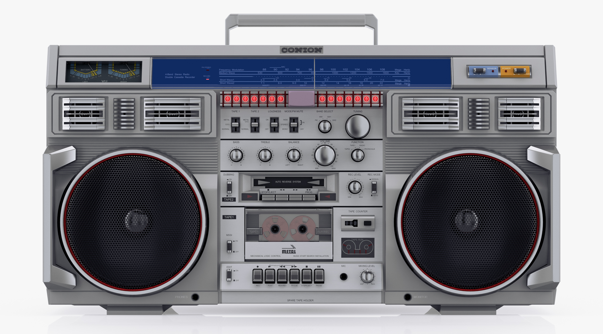

# Full-stack Tech Test

## The Project

Our client "SoNotSonos" (bonus points for a cheesier name) has developed a new music device for the home. You've been tasked with getting the base project up and running.

Currently they've only got two music streams, but they do have plans for the future to offer more. See [Resources](#resources) for the table of streams.

<div style="text-align: center">
    
</div>

## What's the client looking for?

- A nodejs API service that controls a process on this new device.
- A web app to control and display the state of the process on the device.
- Your selection of modern and **desirable** frameworks for [frontend] and [backend].
- This service should be controllable from any device on the local network. ie I should be able to open two tabs and have them both update.
- Play/Pause should reflect the state of the player.
- The web app needs to show the stream and image that is currently playing on the service - either use 500ms polling or websockets.
- Use [Water.css] for the web app - any other CSS needs to be handwritten. They're not worried about the looks of it.
- Complete setup of linters, Readme's, formatters, any tooling etc thats required.
- Audio playback is controlled via [spawning a node child process] feel free to use an npm library but the standard node lib does work.
- You do not need to reflect the output of the process - only the state and selected stream.
- Please test the command before starting:

  ```sh
  # VLC media player needs to be installed

  vlc http://listen.181fm.com/181-eagle_128k.mp3
  ```

  If you can't run the above, a loop-while-true shell script printing out the stream name is an acceptable alternative.

## Notes

[Please see the main readme](../README.md)

## Resources

- Images for the streams in [./assets](./assets)
- Streams:

  | Stream Name         | Stream Image               | URL                                             |
  | ------------------- | -------------------------- | ----------------------------------------------- |
  | The Eagle (Classic) | ./assets/eagle-classic.jpg | http://listen.181fm.com/181-eagle_128k.mp3      |
  | Awesome 80's        | ./assets/awesome-80s.jpg   | http://listen.181fm.com/181-awesome80s_128k.mp3 |

<!-- MARKDOWN REFERENCES -->

[frontend]: https://2019.stateofjs.com/front-end-frameworks/
[backend]: https://2019.stateofjs.com/back-end/
[spawning a node child process]: https://nodejs.org/api/child_process.html#child_process_child_process_spawn_command_args_options
[water.css]: https://github.com/kognise/water.css
